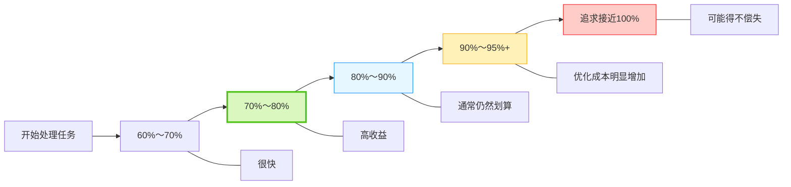
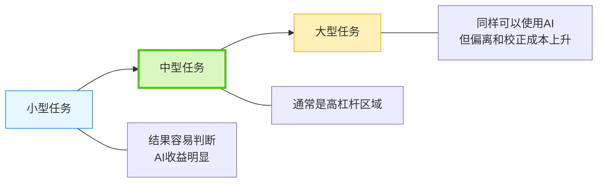

最近在实际使用 AI 的过程中，我越来越觉得：**AI 是否有价值，并不取决于它能不能把一个任务做到 100%。**

相比“完整替代人”，我现在更关心的是另一件事：

> **AI 能不能用很低的成本，快速完成这个任务中最耗时间的部分。**

如果一个原来需要很长时间完成的工作，AI 能快速完成其中 60%、70% 或 80%，剩余部分由人很快收尾，那么它已经产生了很高的价值。

这也是我在实际使用 OpenClaw 处理工作任务以后，逐渐形成的一种感受。

---

## 一、这个“甜蜜区间”是从实际使用中发现的

我在 OpenClaw 里做过一类比较典型的工作：**对点位、设备数据进行整理和清洗。**

这类任务本身有一定规则，但原始数据又不是完全规整的。如果全部人工处理，需要花很多时间逐条判断和整理。

一开始很自然地会想到，让 AI 直接理解数据，然后通过 Prompt 去做提取、分类和整理。

这种方式当然可以做，而且效果可能并不差。

但真正使用以后会发现一个问题：

**让 AI 做到“基本可用”并不困难，让它做到“非常稳定、接近完美”却越来越贵。**

比如一个数据整理任务，AI 很快就可以完成其中 60%～80%，这时候效率非常高。大部分机械性的整理工作已经被解决，我只需要处理少量异常情况。

但如果继续要求：

> 90% 呢？ 
> 95% 呢？ 
> 能不能每一次都完全正确？

事情就开始变化。

为了提高最后这些准确度，可能需要不断调整 Prompt、补充规则、增加样例、重新测试，然后再处理新的边界情况。

最后会发现：

> **提升的准确率越来越少，但付出的时间越来越多。**

这就是我真正开始意识到“甜蜜区间”的地方。

这里的百分比当然不是一个严格的数学指标，更接近实际使用中的主观感受。

但这种趋势很明显：

> **AI 前面的大部分工作往往完成得非常快，越接近“完美”，边际成本越高。**

---

## 二、有时候最好的 AI 用法，是让 AI 帮我写程序

点位数据整理这个实践还有另外一个很有意思的地方。

如果一直让模型通过 Prompt 对数据逐条理解、提取和判断，本质上每一次都在重新进行一次推理。

它能够做到，但速度、稳定性以及后续优化成本未必是最优的。

后来我会采用另外一种方式：

**先让 AI 理解这个问题，再让 AI 自己把已经能够明确描述的规则写成脚本。**

然后由脚本真正进行批量处理。

这种方式给我的感受反而更好。

因为对于 AI 来说，生成一个用于数据清洗的脚本其实很快。一旦规则能够程序化，真正执行的时候就没有必要继续让模型逐条判断。

它可能并没有处理掉所有特殊情况，但只要能够覆盖大部分正常数据，比如做到 80%～90% 的有效处理，实际上已经非常划算。

剩余少量异常由人处理，往往比继续花大量时间调 Prompt 更高效。

所以我逐渐发现：

> **AI 的价值不一定是自己把所有数据处理完，而是快速帮我找到一种能够解决大部分问题的方法。**

这两者其实有很大的区别。

如果最终目标是完成工作，那么没有必要执着于“必须由 AI 自己完成”。

AI 帮我写出一个脚本，脚本完成 80%～90%，我再处理剩余部分，同样是 AI 带来的效率提升。

甚至很多时候，这是更好的使用方式。

---

## 三、AI 的边界，本质上还是投入产出比

这种现象并不仅仅存在于数据清洗中。

在代码修改、脚本生成、问题排查、局部重构这类小型和中型任务中，我也有类似的感受。

这些任务通常：

- 范围比较明确；
- 上下文比较有限；
- 结果比较容易检查；
- AI 做完以后，人很容易继续接手。

因此，即使 AI 没有做到 100%，依然能够明显降低工作时间。

而随着任务越来越复杂，情况会逐渐发生变化。

这并不意味着大型任务不能使用 AI。

比如：

- 架构设计；
- 技术方案；
- 项目规划；
- 模块拆解；
- 大规模重构思路；

AI 同样可以提供很大的帮助。

只是大型任务包含的上下文和决策更多，执行链路也更长。AI 在前面产生的一个小偏差，到了后面可能被逐渐放大。

所以大型任务里面，人的作用会更加明显。

可能不是：

> 把任务完整交出去，最后只看结果。

而是：

> **AI 帮助分析、规划和执行，人不断判断方向有没有发生偏离。**

因此真正的边界并不是简单地划成：

> 小任务可以用 AI，大任务不能用 AI。

而应该是：

> **随着任务复杂度增加，对人的判断和介入要求也会增加。**

---

## 结语：真正重要的是找到 AI 最有杠杆率的位置

经过这些实际使用以后，我现在越来越不在意 AI 是否真正完成了“100%”。

我更在意的是：

> **它帮我省了多少时间。**

如果一个任务 AI 做到 70%，我十分钟就能补完，那么这次 AI 使用就是成功的。

如果 AI 已经做到 95%，但为了最后 5% 还需要投入大量时间去调 Prompt、检查和返工，那就可能已经不划算了。

所以我现在理解的“AI 甜蜜区间”，其实就是：

> **AI 节省的时间最多，而人为了管理、检查和纠正 AI 所付出的成本还很低的那一段。**

这也是为什么真正会使用 AI，可能不只是“会不会写 Prompt”或者“会不会用 Agent”。

更重要的是一种判断力，甚至可以说是一种 **AI 使用品位**：

知道什么事情应该交给 AI；

知道应该让 AI 做到什么程度；

知道什么时候继续优化已经没有意义；

也知道什么时候应该自己接手，或者直接让 AI 写一个普通程序来解决。

所以我目前对 AI 工作边界的理解，可以暂时归结成一句话：

> **AI 的价值不在于把所有事情做到 100%，而在于找到它投入最少、收益最大的那一段。**

真正高效的 AI 使用，不是追求“全部 AI 化”，而是不断找到自己工作中那些 **AI 杠杆率最高的甜蜜区间**。
