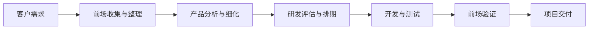
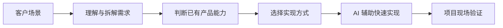
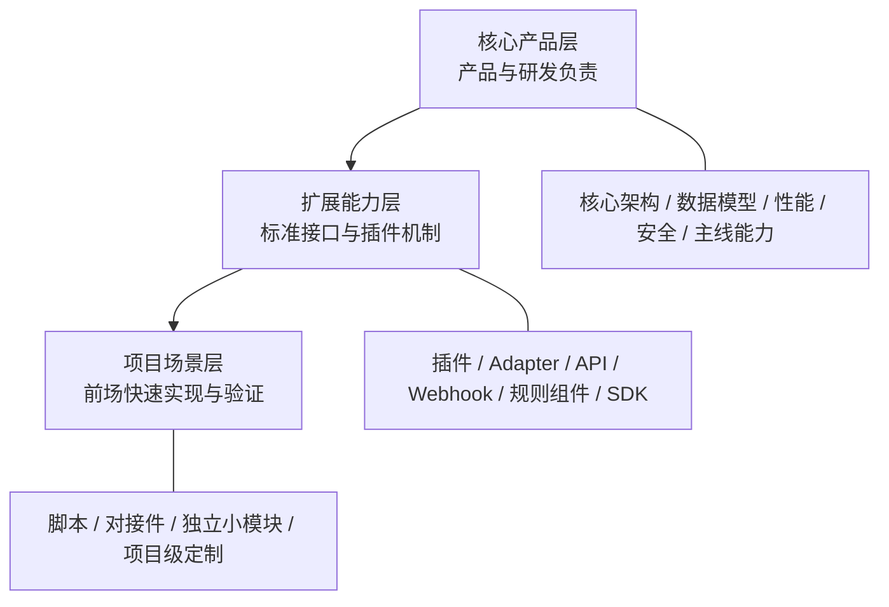
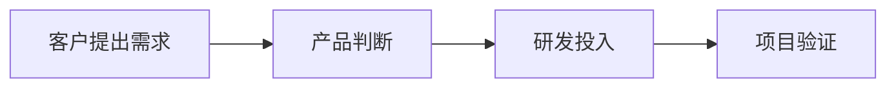
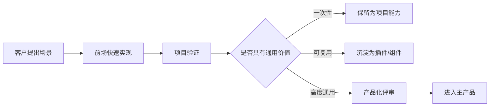
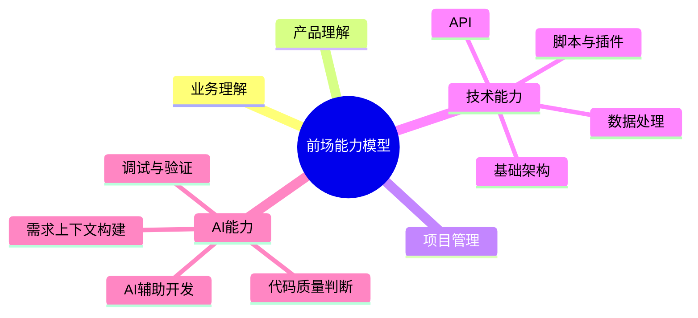
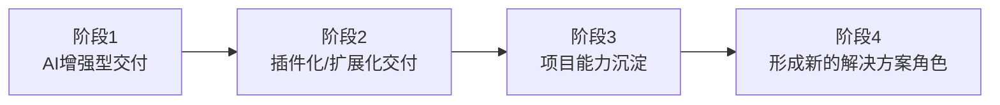
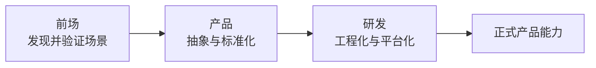

最近在实际项目交付过程中，我一直在思考一个问题：

> **随着 AI 开发能力越来越强，传统的产品、研发和交付之间的边界，会不会发生变化？**

这个思考和我当前所处的工作环境有很直接的关系。

我们目前整体上仍然是一种**主产品驱动**的模式。前场团队直接面对客户，除了实施交付以外，通常还会承担需求沟通、项目管理、问题解决，以及一定程度的售前和方案工作。

与此同时，真实项目中又不可避免地会出现大量个性化需求。

过去面对这类需求，通常需要经过一条比较完整的链路：

这套模式本身没有问题，但它背后有一个重要前提：

> **研发能力是一种相对稀缺的资源。**

因此，对于一些只服务于少数项目、暂时又无法沉淀为标准产品的“小而具体”的需求，往往会出现研发投入与项目收益不匹配的问题。

而 AI 的出现，正在改变这个前提。

---

## 一、AI 让一部分研发能力开始向前场延伸

随着 AI 编程能力的发展，一个具备一定技术基础，同时理解产品和客户场景的人，已经能够完成一部分过去必须依赖专业研发人员才能完成的工作，例如：

- 项目脚本和自动化工具；
- 数据转换和系统对接；
- 特定接口适配；
- 独立的小型服务或模块；
- 场景化的数据处理逻辑。

这并不意味着前场要替代研发。

真正发生的变化是：

> **前场开始具备把客户场景快速转换成“可运行方案”的能力。**

过去的交付更多承担“需求传递”和“产品落地”，未来则可能进一步参与：

这样，一部分个性化需求不需要一开始就进入完整的正式研发流程，而可以先低成本验证其价值。

---

## 二、前场可以开发，但必须和主产品建立边界

AI 降低了代码生产成本，但并没有降低软件长期维护的复杂度。

如果前场具备开发能力以后，每个项目都直接修改主产品，最终很容易形成大量客户分支和特殊逻辑。短期看响应速度提高了，长期却会带来版本升级困难、代码耦合和维护成本失控。

因此，我更倾向于一个原则：

> **核心产品保持稳定，项目变化尽可能外置。**

可以把整体能力简单划分为三层：

其中：

- **核心产品层**：继续由正式产品和研发团队负责，保证架构、性能、安全和长期版本演进；
- **扩展能力层**：由产品提供标准化扩展机制，为项目定制建立明确边界；
- **项目场景层**：前场可以借助 AI 快速开发脚本、插件、小模块和项目级能力。

这里的核心不是“让前场去改产品”，而是让前场拥有一个**受控、可维护、可沉淀的开发空间**。

---

## 三、项目定制可以成为产品能力的前置验证

如果这种模式能够建立起来，它的价值就不只是减少研发压力。

更重要的是，它可能改变产品需求的验证方式。

过去通常是：

本质上是：**先投入，再验证。**

未来可以增加另一条路径：

这样，一个项目需求最终可以有三种去向：

1. **一次性项目需求**：保留为项目脚本、小工具或项目模块；
2. **重复出现但存在差异的需求**：沉淀为插件、组件或标准对接件；
3. **经过多个项目验证的共性需求**：由产品和研发重新设计，正式进入主产品。

最终形成一条新的产品演进路径：

> **客户场景 → 项目验证 → 可复用能力 → 产品能力**

这时，项目交付不再只是产品生命周期的最后一环，也开始成为产品能力孵化的入口。

---

## 四、前场角色也会随之发生变化

结合当前的实际工作来看，前场本身已经承担了比较综合的职责，包括：

- 客户沟通；
- 需求理解；
- 项目管理；
- 实施交付；
- 问题排查；
- 一部分技术定制。

如果继续沿着这个方向发展，未来前场人员的能力模型可能进一步变成：

这里最重要的并不是把交付人员培养成专业研发，而是让他具备几种关键判断能力：

- 能把客户场景拆成具体的产品和技术问题；
- 能判断什么可以通过配置解决；
- 能判断什么适合脚本、插件或小模块快速验证；
- 能判断什么必须进入正式产品研发；
- 能把已经验证有效的项目能力重新抽象出来。

从角色定位上看，这已经开始接近 **Solution Engineer / FDE（Forward Deployed Engineer）** 的一些特点。

但对我们当前阶段来说，更现实的方式并不是立即建立一个完全独立的新岗位，而是：

> **先把这种能力逐步融合到现有交付体系中。**

---

## 五、我理解的一条现实演进路径

结合现有的组织和产品形态，我认为更合理的方式是逐步演进，而不是一次性重构。

### 阶段 1：AI 增强型交付

首先让 AI 服务于现有工作：

- 编写项目脚本；
- 数据处理；
- 接口适配；
- 辅助调试；
- 自动生成测试；
- 项目文档。

### 阶段 2：插件化 / 扩展化交付

逐步建立主产品之外的扩展能力：

- 插件；
- 标准对接件；
- 独立小模块；
- 通用脚本库；
- 扩展 API 和 SDK。

### 阶段 3：建立项目能力沉淀机制

把项目产生的能力进行分类：

- 一次性项目能力；
- 可复用项目能力；
- 产品候选能力。

让项目定制不再只是“做完即结束”，而能够形成持续积累。

### 阶段 4：形成新的解决方案角色

当产品边界、技术规范和沉淀机制逐渐成熟以后，前场角色才可能真正演进成更加完整的 Solution Engineer / FDE 类型角色。

---

## 结语

所以，我现在对 AI 和项目交付的理解，已经不太局限于“AI 能不能帮助交付人员提高效率”。

更值得关注的是：

> **当开发能力不再像过去一样高度稀缺以后，公司是否可以重新划分产品、研发和前场之间的边界。**

我理解的一种可能方向是：

- **研发**负责把核心平台和长期能力做深；
- **前场**依靠对客户和业务场景的理解，把场景做宽，并借助 AI 快速完成验证；
- **产品**负责从已经验证的项目能力中完成抽象和标准化。

可以把这种关系概括为：

过去，项目交付的重点是：

> **把已有产品交付给客户。**

未来，它可能还会多承担一项工作：

> **在交付过程中，持续发现、验证并孵化下一步的产品能力。**

这可能是 AI 时代项目交付值得探索的一种新形态。
