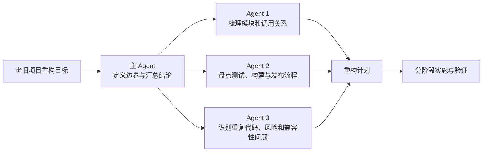

使用 Agent 时，最实用的不是记住每个档位的定义，而是先判断：这件事到底有多难，难在哪里。

改一个变量名，答案往往就在眼前；排查一个深层 Bug，需要沿着调用链、日志和环境一点点排除；重构一个老旧项目，则往往要先摸清模块关系、隐含规则和迁移风险。它们不该用同一档推理强度。

推理投入越高，通常意味着更长的思考和响应时间；具备工具能力的 Agent，也往往会有更充分的分析、规划和检查。简单任务开太高，只是等待更久；复杂任务开太低，容易走错方向，后面返工反而更慢。

本文先用常见的 Light、Medium、High 和 Extra High 说明单 Agent 的推理投入分级，再以 Codex Ultra 为例介绍多 Agent 协作。不同产品的名称和可用能力可能不同，但按任务复杂度分配推理资源的思路是通用的。

## 单 Agent 的推理投入分级

| 档位 | 任务特征 | 典型例子 | 相对投入 | 使用提醒 |
| --- | --- | --- | --- | --- |
| Light | 目标明确、范围很小、结果容易检查 | 改变量名、文案、配置，修复简单格式问题 | 最低、最快 | 不要用高档位处理机械修改 |
| Medium | 需要理解少量上下文，步骤比较常规 | 增加接口字段、补测试、修复普通 Bug | 中等 | 可作为大多数日常任务的默认值 |
| High | 涉及多个文件或模块，需要先分析再修改 | 调整业务流程、排查跨模块失败、比较实现方案 | 较高 | 适合“直接改容易漏东西”的任务 |
| Extra High | 根因不清、链路很深、错误代价高，且需要统一上下文 | 偶发线上 Bug、认证链路异常、数据一致性问题 | 很高、等待更久 | 先准备日志、复现条件和验证方法 |

这四档都是“一个 Agent 做一件事”时的投入差异：推理投入越高，通常需要更多思考和响应时间。它们是相对概念，不代表所有 Agent 产品都有完全相同的名称或实现。

## 多 Agent 协作：以 Codex Ultra 为例

在当前 Codex 的定义中，Ultra 不应理解为 Extra High 的下一档。它是一种多 Agent 协作模式：主 Agent 将可独立推进的部分交给 subagents，再汇总结论。因此，是否选择 Ultra，不取决于任务是否“特别难”，而取决于任务是否“足够大且能够拆开”。

老旧项目重构是一个典型场景。它通常同时包含模块梳理、依赖分析、测试盘点、重复代码识别和迁移风险评估。把这些调查工作拆给多个 Agent，比让一个 Agent 从头到尾串行摸索更合适。

可以这样拆：

这里的关键是“能拆”。如果多个 Agent 都在改同一段核心逻辑，或者后一步完全依赖前一步的结论，Ultra 反而会增加协调成本。不能有效拆分的复杂问题，通常优先使用高推理投入的单 Agent；选择 High 还是 Extra High，仍取决于上下文规模、根因的不确定性和出错成本。其他 Agent 产品即使没有名为 Ultra 的选项，也可能提供类似的 subagent、delegation 或 multi-agent 能力，应按该产品的实际行为判断。

## 选择推理投入的原则

选择推理投入不是从低到高逐级试一遍，而是在开始前判断：这个任务需要多少理解和判断，做错后会付出多大代价，以及工作能否拆开。

- **确定性高，就少投入。** 改变量名、文案或配置时，目标、位置和验收结果都很明确，Light 足够。
- **上下文越多、取舍越多，推理投入越高。** 当 Agent 必须理解多个模块、比较方案或避免兼容性问题时，应该直接选择 High；根因很深、不能轻易试错时，选择 Extra High。
- **风险决定检查深度。** 即使改动不大，权限、支付、数据删除和数据一致性相关的任务也不应只因为代码行数少就使用 Light。
- **能拆就协作，不能拆就深入。** 可独立调查或实现的部分适合多 Agent 协作；一条前后强依赖、需要持续保持上下文的链路，更适合高推理投入的单 Agent。

档位不是质量开关。高档位不能替代清楚的任务描述、完整的日志和可靠的测试；反过来，把目标、约束和验收标准讲明白，也能让较低的推理投入完成原本看似复杂的工作。
