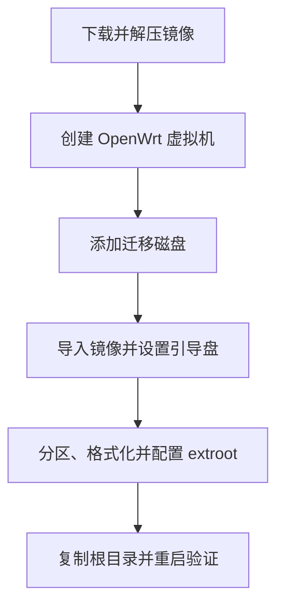

本文记录在 PVE 中安装 OpenWrt 旁路由并使用 extroot 扩容的过程。

## 环境

- Proxmox VE：9.2.11
- OpenWrt：25.12.5

示例参数：VMID `102`、存储 `local-lvm`、迁移磁盘 `/dev/sdb`。

## 部署流程



## 下载并解压 OpenWrt 镜像

在 PVE Shell 中执行：

```bash
cd /var/lib/vz/template/iso

wget https://downloads.openwrt.org/releases/25.12.5/targets/x86/64/openwrt-25.12.5-x86-64-generic-ext4-combined.img.gz
gunzip openwrt-25.12.5-x86-64-generic-ext4-combined.img.gz
```

## 创建 OpenWrt 虚拟机

在 PVE Web 界面点击“创建虚拟机”，按下面设置：

1. **常规**：填写虚拟机名称（例如 `OpenWrt`）和自定义 VMID（示例为 `102`）。
2. **操作系统**：选择“不使用任何介质”。
3. **系统**：BIOS 选择 `SeaBIOS`。
4. **磁盘**：删除向导自动创建的磁盘。
5. **CPU**：1 核；**内存**：512 MB。
6. **网络**：网卡模型选择 `VirtIO`，桥接到实际使用的网桥（例如 `vmbr0`）。
7. 完成创建后不要启动虚拟机。

PVE 创建虚拟机向导的界面可参考 [Proxmox VE 官方文档](https://pve.proxmox.com/pve-docs/pve-admin-guide.html)。

## 添加迁移磁盘

在虚拟机的“硬件”页点击“添加 → 硬盘”：

1. 存储选择用于保存虚拟机磁盘的存储，例如 `local-lvm`。
2. 容量按需要设置，例如 `8G`。
3. 总线/设备选择 `VirtIO`，点击“添加”。

该磁盘用于保存迁移后的根文件系统。

## 导入 OpenWrt 镜像

先在 PVE Shell 执行：

```bash
pvesm status
```

选择 `Status` 为 `active`、`Enabled` 为 `yes` 且 `Content` 包含 `images` 的存储，使用第一列的存储 ID。

```bash
qm importdisk 102 \
  /var/lib/vz/template/iso/openwrt-25.12.5-x86-64-generic-ext4-combined.img \
  local-lvm
```

将镜像导入后回到 PVE Web 界面：

1. 在「硬件」中双击「未使用的磁盘 0」。
2. 总线选择 `VirtIO` 并点击「添加」，导入的镜像盘会显示为 `virtio0`。
3. 确认硬件列表中有镜像系统盘和迁移磁盘。

## 设置引导盘

打开“选项 → 引导顺序”：

1. 将导入的 `virtio0` 移到第一位。
2. 取消 CD-ROM 及其他设备的引导选项，只保留 `virtio0`。

## 启动 OpenWrt

在 PVE Shell 中启动并进入控制台：

```bash
qm start 102
qm console 102
```

```bash
apk update                                      # 更新软件包索引
apk add fdisk block-mount luci-i18n-base-zh-cn  # 分区、挂载和中文界面
```

| 软件包 | 用途 |
| --- | --- |
| `fdisk` | 查看磁盘并创建分区。 |
| `block-mount` | 提供块设备识别、挂载配置和 LuCI「挂载点」页面。 |
| `luci-i18n-base-zh-cn` | 提供 LuCI 中文界面（可选）。 |

## 配置 extroot 扩容

### 确认新增磁盘

```bash
fdisk -l  # 查看磁盘，找到刚添加且没有系统分区的设备
```

下面以 `/dev/sdb` 为例。

### 创建分区并格式化

```bash
fdisk /dev/sdb
```

```text
n       # 新建分区
p       # 主分区
1       # 分区号
        # 起始扇区：回车使用默认值
        # 结束扇区：回车使用全部空间
w       # 写入分区表并退出
```

```bash
mkfs.ext4 /dev/sdb1  # 将新分区格式化为 ext4
```

### 在 LuCI 中启用根文件系统挂载

1. 登录 OpenWrt LuCI 管理页面。
2. 进入「系统」→「挂载点」，点击「生成配置」。
3. 找到新分区（例如 `/dev/sdb1`），勾选「已启动」和「作为根文件系统」。
4. 点击「保存」；确认设备名与 `fdisk -l` 的实际结果一致。

LuCI 挂载点页面可参考 [OpenWrt 官方 extroot 文档](https://openwrt.org/docs/guide-user/additional-software/extroot_configuration)。

### 复制现有根目录

以下命令全部在 OpenWrt 控制台执行：

```bash
mkdir -p /tmp/introot /tmp/extroot

# 将当前根目录绑定到临时目录
mount --bind / /tmp/introot

# 挂载新分区
mount /dev/sdb1 /tmp/extroot

# 保留权限、目录结构和文件内容，复制整个根文件系统
tar -C /tmp/introot -cvf - . | tar -C /tmp/extroot -xf -

umount /tmp/introot
umount /tmp/extroot
```

## 重启并验证

```bash
reboot
```

系统重新启动后登录控制台，执行：

```bash
df -h
```

检查 `/` 对应的设备和容量是否已经变为迁移磁盘。
