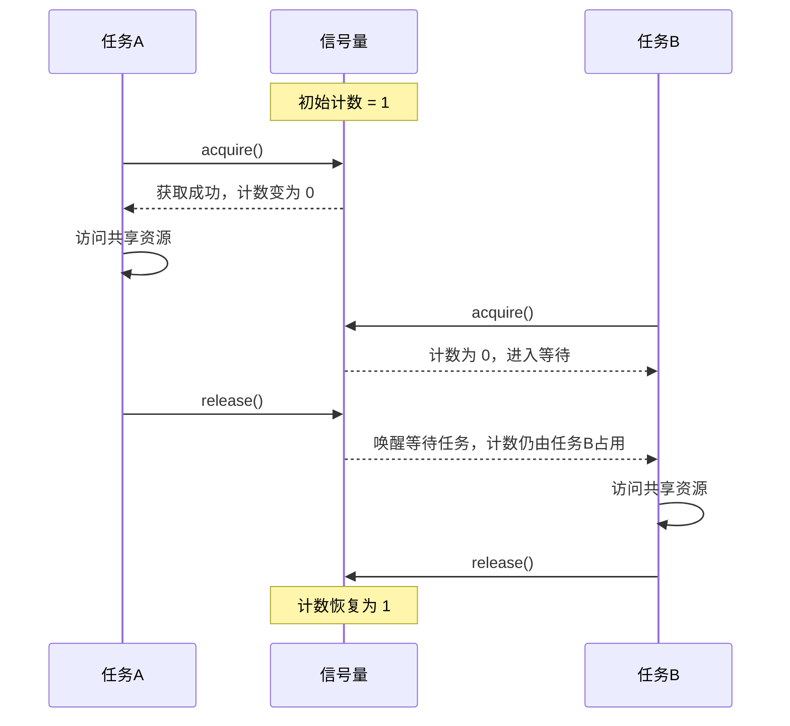

## 什么是信号量

信号量（Semaphore）是一种用于控制并发数量的同步工具。

可以把它理解成“有限数量的通行证”：

- 有通行证时，任务可以继续执行。
- 没有通行证时，任务需要等待。
- 任务执行完后，需要归还通行证。

在 Python 中，信号量常用于限制多个线程或协程同时进入某段关键逻辑。

## 基本原理

信号量内部维护一个计数器。

- `acquire()`：申请一个资源，计数器减 1。
- `release()`：释放一个资源，计数器加 1。
- 当计数器为 0 时，新的任务会阻塞等待。

## 状态变化

信号量的状态主要由两个部分组成：

- 当前可用计数。
- 正在等待的任务队列。

当任务调用 `acquire()` 时：

- 如果计数大于 0，说明还有可用资源，任务可以继续执行，计数减 1。
- 如果计数等于 0，说明资源已经被占满，任务会进入等待状态。

当任务调用 `release()` 时：

- 如果有任务正在等待，信号量会唤醒其中一个等待任务。
- 如果没有任务等待，计数加 1，表示多了一个可用资源。

所以，信号量并不是直接管理资源本身，而是通过计数器管理“允许同时进入的任务数量”。

## 机制特点

信号量有几个重要特点：

- 它控制的是并发数量，不是任务执行顺序。
- 它依赖 `acquire()` 和 `release()` 成对出现。
- 它的初始计数决定了最多允许多少个任务同时进入。
- 它通过等待队列保存暂时无法继续执行的任务。

## 总结

信号量的本质是一个带等待能力的计数器。

它的核心思想很简单：先申请，后执行，最后释放。
