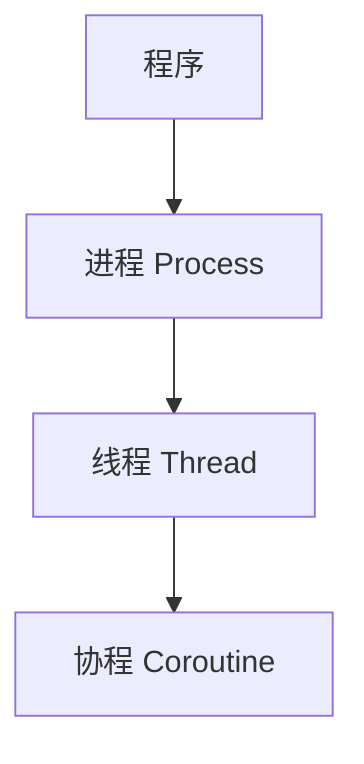

## 总体描述

进程、线程、协程都用于解决“并发”问题，但它们所在的层次和解决的问题不同：

- 一个程序可以启动多个进程。
- 一个进程中可以启动多个线程。
- 一个线程中可以运行一个事件循环，事件循环中可以调度多个协程。

可以简单理解为：

简单来说：

- 进程更关注资源隔离和 CPU 并行。
- 线程更关注同一进程内的并发执行。
- 协程更关注单线程内的大量 I/O 等待任务。

## 进程

进程（Process）是操作系统分配资源的基本单位。每个进程都有独立的内存空间，进程之间默认不共享数据。

特点：

- 资源隔离：强。一个进程崩溃通常不会直接影响其他进程。
- 调度方式：由操作系统调度。
- 并行能力：可以利用多核 CPU，适合 CPU 密集型任务。
- 使用成本：创建和切换成本较高，进程间通信较麻烦。

适合场景：

- 图片处理
- 视频转码
- 大量计算
- 数据压缩

## 线程

线程（Thread）是操作系统调度的执行单元。多个线程可以存在于同一个进程中，并共享进程的内存空间。

特点：

- 资源隔离：弱。同一进程内的线程共享数据，通信方便，但也更容易出现数据竞争。
- 调度方式：由操作系统调度。
- 并行能力：在 CPython 中，CPU 密集型任务会受到 GIL 影响。
- 使用成本：比进程轻量，适合处理 I/O 等待。

适合场景：

- 网络请求
- 文件读写
- 数据库访问
- 后台监听任务

## 协程

协程（Coroutine）是用户态的并发方式，常见写法是 `async` / `await`。协程通常运行在单个线程中，由事件循环负责调度。

特点：

- 资源隔离：很弱。多个协程通常共享同一个线程内的数据。
- 调度方式：由事件循环调度，遇到 `await` 时主动让出执行权。
- 并行能力：本身不提供 CPU 并行，主要解决 I/O 并发。
- 使用成本：创建和切换成本很低，但需要异步库配合。

适合场景：

- 高并发 HTTP 请求
- WebSocket
- 异步 Web 服务
- 异步数据库客户端

## 总结

可以从资源隔离、调度方式、并行能力三个角度理解三者的区别：

| 类型 | 资源隔离             | 调度方式     | 并行能力              | 适合场景   | 典型模块                                 |
| ---- | -------------------- | ------------ | --------------------- | ---------- | ---------------------------------------- |
| 进程 | 强，内存默认不共享   | 操作系统调度 | 可以多核并行          | CPU 密集型 | `multiprocessing`、`ProcessPoolExecutor` |
| 线程 | 弱，共享进程内存     | 操作系统调度 | CPython 中受 GIL 影响 | I/O 密集型 | `threading`、`ThreadPoolExecutor`        |
| 协程 | 很弱，共享线程上下文 | 事件循环调度 | 不提供 CPU 并行       | 高并发 I/O | `asyncio`                                |

选择方式：

- CPU 密集型：优先使用进程。
- I/O 密集型，任务量不大：可以使用线程。
- I/O 密集型，连接数很多：优先考虑协程。
- 混合任务：可以组合使用，例如多进程负责计算，每个进程内部再使用线程或协程处理 I/O。
