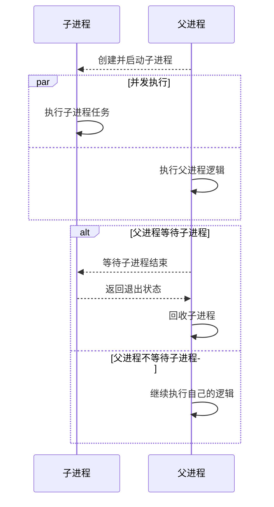
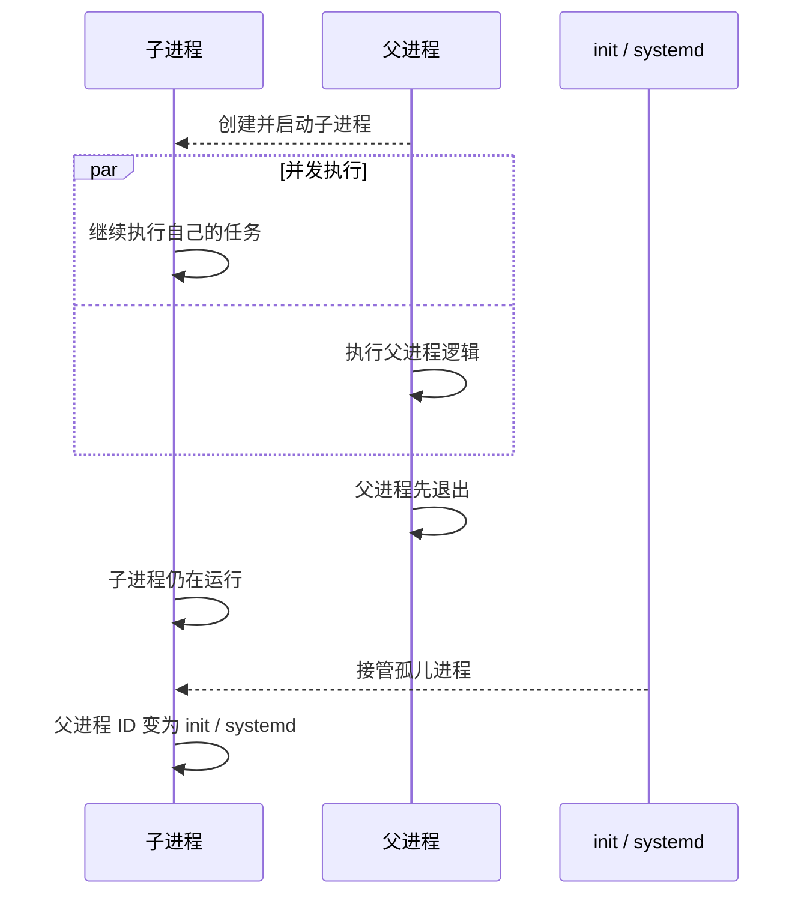
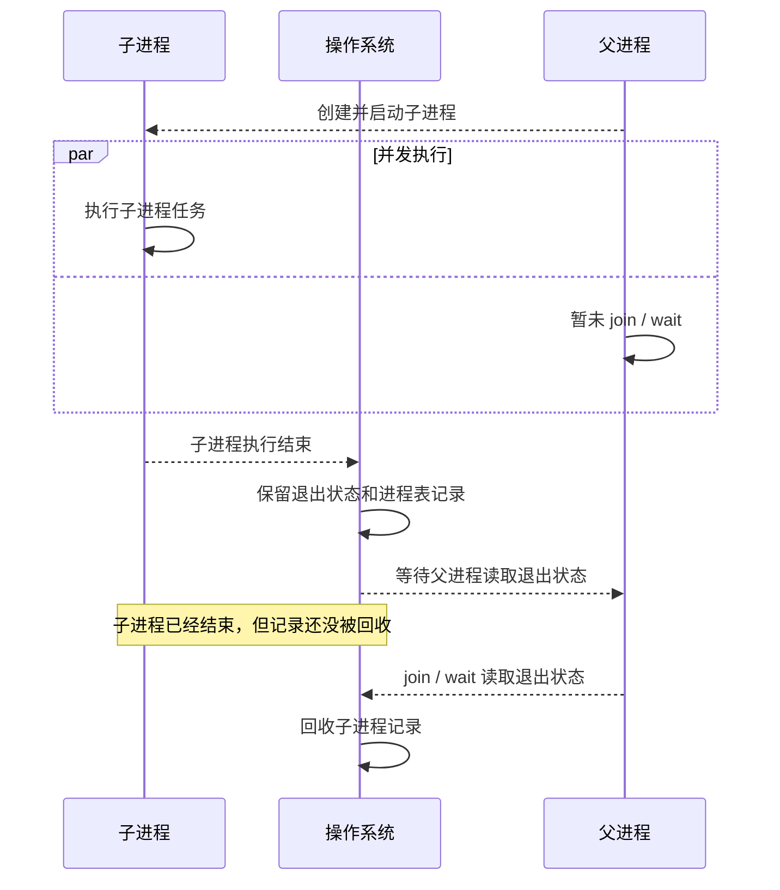
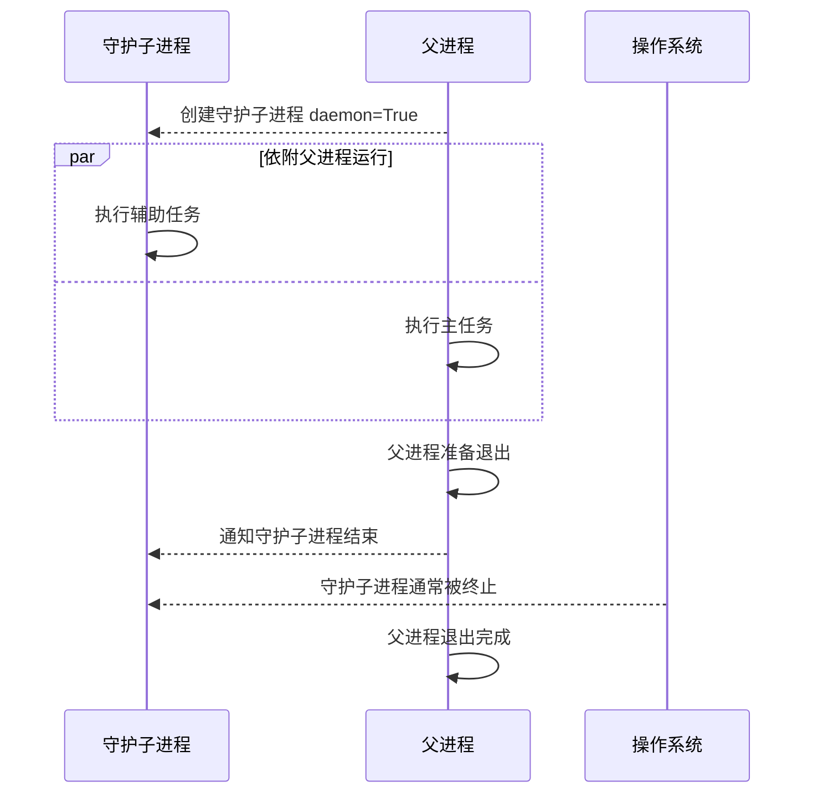

## 父进程和子进程（Parent Process and Child Process）

一个进程在运行过程中，可以创建新的进程。创建者称为父进程，被创建出来的进程称为子进程。

在 Python 中，常见的创建子进程方式有：

- `multiprocessing`
- `subprocess`
- `os.fork`，主要用于 Unix / Linux 系统

父进程和子进程是两个独立的进程。它们有各自的进程 ID、内存空间和执行流程。

### 生命周期

父子进程的生命周期可以简单理解为：

### 创建阶段

父进程创建子进程后，子进程会拥有自己的运行环境。

在操作系统层面，子进程通常会继承父进程的一部分信息，例如环境变量、工作目录、打开的文件描述符等。但子进程不是父进程中的一个函数调用，它是一个独立运行的进程。

在 Python 的 `multiprocessing` 中，父进程通常会先创建 `Process` 对象，然后通过 `start()` 启动子进程。

整体流程是：

- 父进程创建 `Process` 对象。
- `start()` 启动子进程。
- 子进程执行指定任务。
- `join()` 让父进程等待子进程执行结束。

### 执行阶段

子进程启动后，会和父进程并发执行。

如果父进程没有等待子进程，父进程会继续执行自己的代码。子进程则在自己的执行流程中运行，不会阻塞父进程。

### 等待阶段

如果父进程需要获取子进程执行完成的时机，就需要等待子进程。

在 Python 中，常用 `join()` 等待子进程结束。`join()` 的作用是阻塞父进程，直到对应的子进程执行结束。

如果不等待子进程，父进程可能会先执行完自己的逻辑。

### 退出阶段

父进程退出后，子进程是否继续执行，取决于子进程的创建方式和运行环境。

不同的退出顺序会产生不同的进程状态，例如孤儿进程、僵尸进程、守护进程。

## 孤儿进程（Orphan Process）

可以简单理解为：

孤儿进程指的是：父进程已经退出，但子进程仍然在运行的进程。

它“孤儿”的原因是：创建它的原父进程已经结束，但它自己还没有结束。

孤儿进程不会一直处于没有父进程的状态。系统会把它交给初始化进程接管，在 Linux 中通常是 PID 为 1 的 `init` 或 `systemd`。接管之后，孤儿进程的父进程 ID 会变成初始化进程的 PID。

孤儿进程本身不一定是问题。如果子进程本来就需要独立完成任务，那么父进程退出后它继续运行是可以接受的。

## 僵尸进程（Zombie Process）

可以简单理解为：

僵尸进程指的是：子进程已经结束，但父进程还没有读取它的退出状态。

子进程退出后，操作系统需要保留一些信息给父进程读取，例如：

- 子进程的 PID
- 子进程的退出码
- 子进程的资源使用情况

在父进程读取这些信息之前，子进程虽然已经不再运行，但进程表中仍然保留着它的记录，这种状态就是僵尸进程。

僵尸进程不是还在运行的进程，它不会继续占用 CPU，但会占用进程表记录。如果大量僵尸进程长期存在，可能会影响系统继续创建新进程。

在 Python 中，使用 `multiprocessing` 时通常通过 `join()` 等待并回收子进程。

## 守护进程（Daemon Process）

可以简单理解为：

守护进程有两种常见语境，需要区分：

- 操作系统中的守护进程：长期运行在后台的服务进程，例如 `sshd`、`cron`、`nginx`。
- Python `multiprocessing` 中的守护子进程：依附于父进程生命周期的子进程。

在 Python 的 `multiprocessing` 中，守护子进程通常通过 `daemon=True` 设置。它的特点是：父进程退出时，守护子进程通常会被终止，不适合执行必须完整结束的任务。

因此：

- 需要子进程独立完成任务：不要设置为守护子进程。
- 子进程只是辅助父进程工作：可以考虑设置为守护子进程。
